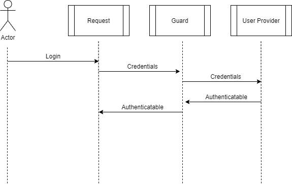

AWS Cognito is AWS's authentication managed service that integrates
natively with API Gateway & Application Load Balancer. Users can sign
up directly with Cognito, Sign In & Recover password. When chasing
high revenue customers in the enterprise world, AWS Cognito allow
us to answer the question "How do you guarantee you're not going
to leak our users' passwords?" with "By not storing it.". AWS stores
users credentials and don't allow us to retrieve it.

Unfortunately for us, Cognito native integration didn't cover enough
grounds. We needed API Gateway to get automatic validation, but we
use Application Load Balancer in front of our APIs instead of API Gateway.
Most of our services run on Fargate and getting API Gateway in front
of a Fargate Container requires a Network Load Balancer, which wasn't
something we wanted to pursue. With Application Load Balancer, Cognito
can only authenticate stateful services in a session-based authentication.
ALB does not offer API authentication with Bearer tokens. We ended
up writing our own validation for Cognito Tokens and in this post
I want to show a simplified way of achieving that. 

#### Understanding Laravel authentication system

Laravel comes with a great out-of-the-box authentication process.
It is composed of a few key concepts: an Authenticatable object,
a User Provider and a Guard.

An Authenticatable object should implement the `Illuminate\Contracts\Auth\Authenticatable`
contract and is basically a Value Object representing the authenticated
user. In other words, An Authenticatable is someone who is authenticated or can
authenticate on your application.
A User Provider should implement the `Illuminate\Contracts\Auth\UserProvider` contract
and is responsible for validating credentials and returning an Authenticatable
object. It provides/factories users based on credentials that are passed to them. 
Lastly, a Guard is responsible for collecting the necessary information from
the user and passing it to a User Provider. If a valid Authenticatable comes
back, the Guard understands that as the credentials has been successfully
validated, otherwise the access is denied.



------------
##### Guards

Laravel comes with two main guards: Session & Token. The Session Guard
provides stateful authentication. It first checks if the class itself
already have a valid user and if not, it tries to fetch the id of the
user from a session storage so that it can ask the User Provider to
load the User using the provided Id. It can also `attempt` to login
using credentials that are sent to the User Provider for validation.
The Token Guard is used for stateless authentication and tries to
fetch a user from the class itself in case it has been validated
within the request itself, otherwise it tries to get a token from 
the Request and pass it to the User Provider. For Cognito Authentication,
we'll be using the Token one.

```php
    public function getTokenForRequest()
    {
        $token = $this->request->query($this->inputKey);

        if (empty($token)) {
            $token = $this->request->input($this->inputKey);
        }

        if (empty($token)) {
            $token = $this->request->bearerToken();
        }

        if (empty($token)) {
            $token = $this->request->getPassword();
        }

        return $token;
    }
```
Source: https://github.com/laravel/framework/blob/7.x/src/Illuminate/Auth/TokenGuard.php#L97

As we can see, the TokenGuard will try to fetch a token from the 
Query Parameters, then from the body of the request and only as a third
option it will try to load a Bearer token from the Header of the request.
For me, this was not an issue. The field in which Laravel will be looking
is called `api_token` by default. I don't expect that field to be filled
and I accept the limitation that if that field is present, authentication
will not work as expected. The Auth configuration can be set as follows:

```php
    'guards' => [
        'cognito-token' => [
            'driver' => 'token',
            'provider' => 'cognito-provider',
            'storage_key' => 'cognito_token',
            'hash' => false,
        ],
    ],

    'providers' => [
        'cognito-provider' => [
            'driver' => \CustomerGauge\Cognito\CognitoUserProvider::class,
        ],
    ],
```

Since we'll be using a standard Guard provided by Laravel, we can
now focus on writing the custom User Provider as well as the Autheticatable
object.

##### Authenticatable

Below you'll find a very slim down implementation of an authenticatable
object. We're using at least some sort of ID here to identify the user.
We are free to put any attribute we want in this object. Some common
cases involve name, email address, role, etc.

Some methods from the Authenticatable interface will be left empty
as we're not going to be making use of them. After all, we're using
a stateless authentication mechanism for APIs that will not
use any sort of cookie or remember process. I also like to include
a static `fake` method as a factory for PHPUnit so that we can
write some tests using this object as authenticated. When extending
Laravel Test Case class, we can call `$this->actingAs(User::fake());`. 

```php
<?php

namespace App\Library\Packages\Authentication;

use Illuminate\Contracts\Auth\Authenticatable;

class User implements Authenticatable
{
    private int $id;

    public function __construct(int $id)
    {
        $this->id = $id;
    }

    public static function fake(): self
    {
        return new self(1);
    }

    public static function fakeWith(array $attributes = []): self
    {
        return new self(1);
    }

    public function id(): int
    {
        return $this->id;
    }

    public function getAuthIdentifierName()
    {
        return '';
    }

    public function getAuthIdentifier()
    {
        return $this->id;
    }

    public function getAuthPassword()
    {
        return '';
    }

    public function setRememberToken($value)
    {
    }

    /** @phpstan ignore */
    public function getRememberToken()
    {
    }

    /** @phpstan ignore */
    public function getRememberTokenName()
    {
    }
}
```

##### User Provider

The User provider is where the heart of this process will be. We can
write a custom User Provider that will receive a Cognito Token, validate
it and then return an authenticatable object. In order to do that
we'll need a few files. 
[These files are available as a package here](https://github.com/cgauge/laravel-cognito-provider).

The authentication process starts with `auth.php` (described above).
There, we configure the Guards as well as the Providers. We can combine
the TokenGuard with the CognitoUserProvider for a stateless authentication.
Once the Laravel request starts, the `Authenticate` middleware (`auth`)
will use the TokenGuard to retrieve the token from the Request object
(Bearer Token) and pass it through the CognitoUserProvider, where we
can try to parse the token into a payload and try to make an Authenticatable
user out of it. If successful, the authentication finishes, otherwise
the middleware throws an AuthenticationException.
 
##### Writing PHPUnit Tests for the Token

This is my favorite part of the process. Once I finished the code,
I had a working authentication process that could validate and
parse AWS Cognito tokens and make them an Authenticatable user
for me. However, I wanted to be able to write tests for this code
using my own private key / public key pair and have the code
validate it the same way. I stumbled upon https://web-token.spomky-labs.com/
which apparently had the ability to generate key pairs for me
following a similar structure to AWS Cognito. I used my `.well-known/jwks.json`
file to figure out the `alg`, `use` and `kty` values. I then used
the [PHAR application](https://web-token.spomky-labs.com/console-command/phar-application)
to generate my own keys and put it to the test. 
[Here is how I built a token](https://github.com/cgauge/laravel-cognito-provider/blob/master/tests/TestCase.php#L39)
and [here is how I mocked the `file_get_contents` for the `.well-known` file](https://github.com/cgauge/laravel-cognito-provider/blob/master/tests/TestCase.php#L31).
After that, I was able to run an automation test against the code
using my own set of keys to get the code validated.

#### Conclusion

I had to dig a bit to understand JWT and JWKS to figure out how to
make a token and validate it against my code without knowing 
Cognito's private key. I always had in the back of my mind a backup
plan which relied on provisioning an AWS Cognito Pool only for
testing purpose, where I could ask for a token and then validate it.
However, I wanted to try to make my test independent of an actual
AWS resource. If AWS is generating a JWT Token and my code is validating
it against the public key, all I had to do is figure out the set
of configurations the AWS private key had in order to generate my own.

I iterated over Laravel's Auth component with this a couple of times
until I had a pleasent implementation. I first wanted to put all
the code in this post, but it ended up being too much code that
could make the reading extensive. This is why I decided to 
publish it on GitHub. It's not fully meant to be a package,
but rather a demonstration of how all of it works.

Hope you enjoyed the reading. If you have any questions,
send them my way on [Twitter](https://twitter.com/deleugyn).

Cheers.