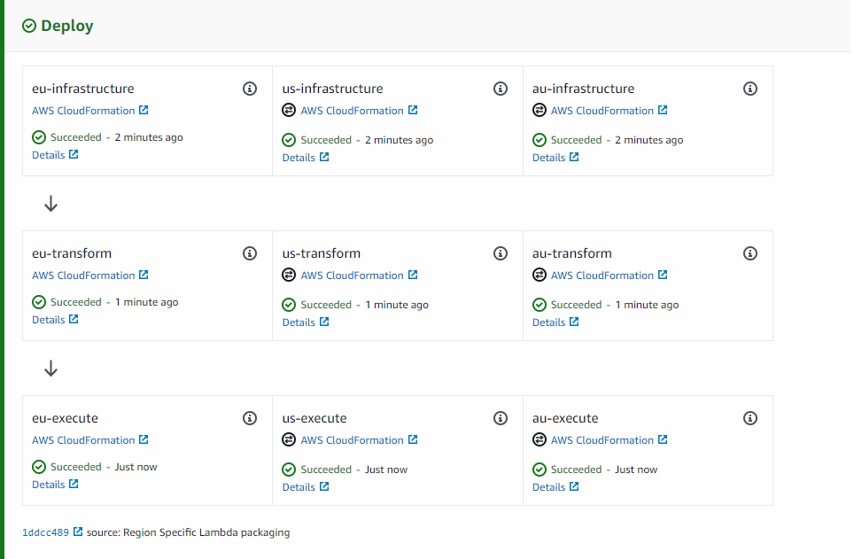

When running a website or public service on the internet, global availability
might be one of the requirements for the project. AWS Lambda@Edge has the
ability to run your Lambda closer to the source of the request. However,
this means running the exact same service/site. I work on an enterprise-level
SaaS that is deployed in Europe, North America and Australia and it is completely
isolated and fully contained in their own region. This makes it specially
easier to deal with regulations such as GDPR by holding european data only
within Europe servers. It also avoids latency issues since each region 
have their own database, load balancer, dns, servers, etc.

To support this setup, I took advantage of CodePipeline support for cross-region
deployment using CloudFormation. The benefit is managing/maintaining a single
pipeline that deploys the same service across multiple regions together.

### Implementation

The first significant requirement that CodePipeline imposes is the availability
of an S3 Bucket on each region that we desire to deploy. After the buckets
are created in their respective region, I decided to use SSM Parameters
to provide the Pipeline with the buckets.

```bash
aws ssm put-parameter \
    --name /Environment/EU/SourceCodeStorage \
    --value bucket-name-region-1 \
    --type String \
    --profile production/eu/administrator

aws ssm put-parameter \
    --name /Environment/US/SourceCodeStorage \
    --value bucket-name-region-2 \
    --type String \
    --profile production/eu/administrator

aws ssm put-parameter \
    --name /Environment/AU/SourceCodeStorage \
    --value bucket-name-region-3 \
    --type String \
    --profile production/eu/administrator
```

Note that I'm creating all these SSM Parameters in the same region (EU).
This is because the Pipeline itself will be in the european region.
In other words, the Pipeline needs 1 bucket per **target region** and we're
going to setup SSM parameters in the **Pipeline region** that holds the
bucket names.

Now that the buckets are all set, we can create the Pipeline itself.

```yaml
Description: Cross Region Pipeline for deploying service X.

Parameters:
  Type: AWS::SSM::Parameter::Value<String>
    Default: /Environment/EU/SourceCodeStorage

  UsBucket:
    Type: AWS::SSM::Parameter::Value<String>
    Default: /Environment/US/SourceCodeStorage

  AuBucket:
    Type: AWS::SSM::Parameter::Value<String>
    Default: /Environment/AU/SourceCodeStorage

Resources:

  CodeBuild:
    Type: AWS::CodeBuild::Project
    Properties:
      Artifacts:
        Type: CODEPIPELINE
      Environment:
        ComputeType: BUILD_GENERAL1_SMALL
        EnvironmentVariables:
          - Name: EU_BUCKET
            Value: !Ref EuBucket
          - Name: US_BUCKET
            Value: !Ref UsBucket
          - Name: AU_BUCKET
            Value: !Ref AuBucket
        Image: aws/codebuild/standard:2.0
        PrivilegedMode: true
        Type: LINUX_CONTAINER
      ServiceRole: !ImportValue GenericCodeBuildRoleArn
      Source:
        Type: CODEPIPELINE
        BuildSpec: amazon/pipeline/production/buildspec.yaml
      TimeoutInMinutes: 15
      Cache:
        Type: LOCAL
        Modes:
          - LOCAL_CUSTOM_CACHE
          - LOCAL_DOCKER_LAYER_CACHE

  CodePipeline:
    Type: AWS::CodePipeline::Pipeline
    Properties:
      Name: service-x
      ArtifactStores:
        - Region: eu-west-1
          ArtifactStore:
            Location: !Ref EuBucket
            Type: S3
        - Region: us-east-1
          ArtifactStore:
            Location: !Ref UsBucket
            Type: S3
        - Region: ap-southeast-2
          ArtifactStore:
            Location: !Ref AuBucket
            Type: S3
      RestartExecutionOnUpdate: false
      RoleArn: !ImportValue GenericCodePipelineRoleArn
      Stages:
        - Name: Source
          Actions:
            - Name: source
              ActionTypeId:
                Category: Source
                Owner: ThirdParty
                Provider: GitHub
                Version: 1
              Configuration:
                Owner: your-github-organization
                Repo: your-github-repository
                Branch: master
                OAuthToken: !ImportValue GitHubOauthToken
                PollForSourceChanges: false
              OutputArtifacts:
                - Name: src

        - Name: Build
          Actions:
            - Name: CodeBuild
              ActionTypeId:
                Category: Build
                Owner: AWS
                Provider: CodeBuild
                Version: 1
              Configuration:
                ProjectName: !Ref CodeBuild
                PrimarySource: src
              InputArtifacts:
                - Name: src
              OutputArtifacts:
                - Name: package

        - Name: Deploy
          Actions:
            - Name: eu-infrastructure
              Region: eu-west-1
              ActionTypeId:
                Category: Deploy
                Owner: AWS
                Provider: CloudFormation
                Version: 1
              Configuration:
                ActionMode: CREATE_UPDATE
                Capabilities: CAPABILITY_IAM
                RoleArn: !ImportValue GenericCloudFormationRoleArn
                StackName: service-x-infrastructure
                TemplatePath: src::amazon/infrastructure/template.yaml
              InputArtifacts:
                - Name: src
              RunOrder: 1

            - Name: us-infrastructure
              Region: us-east-1
              ActionTypeId:
                Category: Deploy
                Owner: AWS
                Provider: CloudFormation
                Version: 1
              Configuration:
                ActionMode: CREATE_UPDATE
                Capabilities: CAPABILITY_IAM
                RoleArn: !ImportValue GenericCloudFormationRoleArn
                StackName: service-x-infrastructure
                TemplatePath: src::amazon/infrastructure/template.yaml
              InputArtifacts:
                - Name: src
              RunOrder: 1

            - Name: au-infrastructure
              Region: ap-southeast-2
              ActionTypeId:
                Category: Deploy
                Owner: AWS
                Provider: CloudFormation
                Version: 1
              Configuration:
                ActionMode: CREATE_UPDATE
                Capabilities: CAPABILITY_IAM
                RoleArn: !ImportValue GenericCloudFormationRoleArn
                StackName: service-x-infrastructure
                TemplatePath: src::amazon/infrastructure/template.yaml
              InputArtifacts:
                - Name: src
              RunOrder: 1

            - Name: eu-transform
              Region: eu-west-1
              ActionTypeId:
                Category: Deploy
                Owner: AWS
                Version: 1
                Provider: CloudFormation
              InputArtifacts:
                - Name: package
              OutputArtifacts: []
              Configuration:
                StackName: service-x-lambda
                ActionMode: CHANGE_SET_REPLACE
                RoleArn: !ImportValue GenericCloudFormationRoleArn
                ChangeSetName: pipeline-changeset
                Capabilities: CAPABILITY_IAM
                TemplatePath: package::eu.lambda.yaml
              RunOrder: 2

            - Name: us-transform
              Region: us-east-1
              ActionTypeId:
                Category: Deploy
                Owner: AWS
                Version: 1
                Provider: CloudFormation
              InputArtifacts:
                - Name: package
              OutputArtifacts: []
              Configuration:
                StackName: service-x-lambda
                ActionMode: CHANGE_SET_REPLACE
                RoleArn: !ImportValue GenericCloudFormationRoleArn
                ChangeSetName: pipeline-changeset
                Capabilities: CAPABILITY_IAM
                TemplatePath: package::us.lambda.yaml
              RunOrder: 2

            - Name: au-transform
              Region: ap-southeast-2
              ActionTypeId:
                Category: Deploy
                Owner: AWS
                Version: 1
                Provider: CloudFormation
              InputArtifacts:
                - Name: package
              OutputArtifacts: []
              Configuration:
                StackName: service-x-lambda
                ActionMode: CHANGE_SET_REPLACE
                RoleArn: !ImportValue GenericCloudFormationRoleArn
                ChangeSetName: pipeline-changeset
                Capabilities: CAPABILITY_IAM
                TemplatePath: package::au.lambda.yaml
              RunOrder: 2

            - Name: eu-execute
              Region: eu-west-1
              InputArtifacts: []
              ActionTypeId:
                Category: Deploy
                Owner: AWS
                Version: 1
                Provider: CloudFormation
              OutputArtifacts: []
              Configuration:
                StackName: service-x-lambda
                ActionMode: CHANGE_SET_EXECUTE
                ChangeSetName: pipeline-changeset
              RunOrder: 3

            - Name: us-execute
              Region: us-east-1
              InputArtifacts: []
              ActionTypeId:
                Category: Deploy
                Owner: AWS
                Version: 1
                Provider: CloudFormation
              OutputArtifacts: []
              Configuration:
                StackName: service-x-lambda
                ActionMode: CHANGE_SET_EXECUTE
                ChangeSetName: pipeline-changeset
              RunOrder: 3

            - Name: au-execute
              Region: ap-southeast-2
              InputArtifacts: []
              ActionTypeId:
                Category: Deploy
                Owner: AWS
                Version: 1
                Provider: CloudFormation
              OutputArtifacts: []
              Configuration:
                StackName: service-x-lambda
                ActionMode: CHANGE_SET_EXECUTE
                ChangeSetName: pipeline-changeset
              RunOrder: 3

  GithubWebhook:
    Type: AWS::CodePipeline::Webhook
    Properties:
      Authentication: GITHUB_HMAC
      AuthenticationConfiguration:
        SecretToken: !ImportValue GitHubOauthToken
      RegisterWithThirdParty: 'true'
      Filters:
        - JsonPath: "$.ref"
          MatchEquals: refs/heads/{Branch}
      TargetPipeline: !Ref CodePipeline
      TargetAction: source
      TargetPipelineVersion: !GetAtt CodePipeline.Version

```

I know this is quite a wall of code, so let's break it down.

```yaml
Parameters:
  Type: AWS::SSM::Parameter::Value<String>
    Default: /Environment/EU/SourceCodeStorage

  UsBucket:
    Type: AWS::SSM::Parameter::Value<String>
    Default: /Environment/US/SourceCodeStorage

  AuBucket:
    Type: AWS::SSM::Parameter::Value<String>
    Default: /Environment/AU/SourceCodeStorage
```

In here we're receiving the SSM Parameters that we created containing the 
region-specific buckets that CodePipeline will use to transfer the source code
around. Note that these parameters will be used by CodeBuild as well as
CodePipeline.

```yaml
  CodeBuild:
    Type: AWS::CodeBuild::Project
    Properties:
      Artifacts:
        Type: CODEPIPELINE
      Environment:
        ComputeType: BUILD_GENERAL1_SMALL
        EnvironmentVariables:
          - Name: EU_BUCKET
            Value: !Ref EuBucket
          - Name: US_BUCKET
            Value: !Ref UsBucket
          - Name: AU_BUCKET
            Value: !Ref AuBucket
        Image: aws/codebuild/standard:2.0
        PrivilegedMode: true
        Type: LINUX_CONTAINER
      ServiceRole: !ImportValue GenericCodeBuildRoleArn
      Source:
        Type: CODEPIPELINE
        BuildSpec: amazon/pipeline/production/buildspec.yaml
      TimeoutInMinutes: 15
      Cache:
        Type: LOCAL
        Modes:
          - LOCAL_CUSTOM_CACHE
          - LOCAL_DOCKER_LAYER_CACHE
```

This is the CodeBuild setup. The most relevant attributes here are the
environment variables containing each region bucket and the `buildSpec` path
which should be placed inside the source code that the Pipeline will fetch
from GitHub. The buildspec.yaml file looks like this:

```yaml
version: 0.2
phases:
  install:
    runtime-versions:
      docker: 18

  pre_build:
    commands:
      - $(aws ecr get-login --region $AWS_REGION --no-include-email)

  build:
    commands:
      - docker run --entrypoint develop.sh \
                   -v $(pwd):/var/task \
                   -v $(pwd)/auth.json:/root/.composer/auth.json \
                   -v /tmp/composer-cache:/root/.composer/cache \
                   -t deleugpn/bref:build-7.3.2
      
      - docker-compose up -d
        
      - docker-compose exec -T -w /var/task service-x /var/task/vendor/bin/phpunit --testdox

      - docker run --rm --name app
        -v $(pwd):/var/task
        -v $(pwd)/auth.json:/root/.composer/auth.json
        -v /tmp/composer-cache:/root/.composer/cache
        -t deleugpn/bref:build-7.3.2

      - rm auth.json -rf

      - aws cloudformation package --template-file ./serverless.yaml --s3-bucket ${EU_BUCKET} --output-template-file eu.lambda.yaml
      - aws cloudformation package --template-file ./serverless.yaml --s3-bucket ${AU_BUCKET} --output-template-file au.lambda.yaml
      - aws cloudformation package --template-file ./serverless.yaml --s3-bucket ${US_BUCKET} --output-template-file us.lambda.yaml

artifacts:
  files:
    - eu.lambda.yaml
    - au.lambda.yaml
    - us.lambda.yaml

cache:
  paths:
    - /tmp/composer-cache
```

The relevant parts are the docker 18 installation, running phpunit to make 
sure the code is working. Running `composer install --no-dev` and finally
packaging the lambda on each region with `aws cloudformation package`.
Don't forget to output the package result as an artifact. We'll use it
on CodePipeline.

Next, we get to the Pipeline itself. Let's break it down in 4 pieces:
- General Settings
- Source
- Build
- Deploy

##### General Settings

```yaml
  CodePipeline:
    Type: AWS::CodePipeline::Pipeline
    Properties:
      Name: service-x
      ArtifactStores:
        - Region: eu-west-1
          ArtifactStore:
            Location: !Ref EuBucket
            Type: S3
        - Region: us-east-1
          ArtifactStore:
            Location: !Ref UsBucket
            Type: S3
        - Region: ap-southeast-2
          ArtifactStore:
            Location: !Ref AuBucket
            Type: S3
      RestartExecutionOnUpdate: false
      RoleArn: !ImportValue GenericCodePipelineRoleArn
```

Here we configure each bucket region so that the Pipeline knows how to transfer
the source code to the target region we want to run the deploy.

##### Source

```yaml
        - Name: Source
          Actions:
            - Name: source
              ActionTypeId:
                Category: Source
                Owner: ThirdParty
                Provider: GitHub
                Version: 1
              Configuration:
                Owner: your-github-organization
                Repo: your-github-repository
                Branch: master
                OAuthToken: !ImportValue GitHubOauthToken
                PollForSourceChanges: false
              OutputArtifacts:
                - Name: src
```

Here we configure the Pipeline to get the source code from GitHub. Configure
your organization and your repository name, as well as the branch and
the OAuth token. Specify an output artifact name that will be referenced
as the input of the next step. At the end of the template there's an 
extra resource for GitHub Webhook. It's the resource that starts the
CodePipeline upon commit.

```yaml
  GithubWebhook:
    Type: AWS::CodePipeline::Webhook
    Properties:
      Authentication: GITHUB_HMAC
      AuthenticationConfiguration:
        SecretToken: !ImportValue GitHubOauthToken
      RegisterWithThirdParty: 'true'
      Filters:
        - JsonPath: "$.ref"
          MatchEquals: refs/heads/{Branch}
      TargetPipeline: !Ref CodePipeline
      TargetAction: source
      TargetPipelineVersion: !GetAtt CodePipeline.Version
```

##### Build

The build is where we reference the CodeBuild that we setup in the beginning
of the template. We also have to specify the input artifact (Source Code)
that was provided by the Source step. Lastly, specify an output artifact
so that we can access the lambda package files.

```yaml
        - Name: Build
          Actions:
            - Name: CodeBuild
              ActionTypeId:
                Category: Build
                Owner: AWS
                Provider: CodeBuild
                Version: 1
              Configuration:
                ProjectName: !Ref CodeBuild
                PrimarySource: src
              InputArtifacts:
                - Name: src
              OutputArtifacts:
                - Name: package
``` 

##### Deploy

The last step is the one that actually performs the cross-region deploy
using AWS CloudFormation. I did 9 actions in that step that is broken down
as:

- Setup infrastructure on each region (3 actions)
- Create a CloudFormation Changeset using the Lambda package (3 actions)
- Execute the Changeset (3 actions).

I took advantage of the `RunOrder` parameter to run infrastructure in parallel
and then perform a create changeset and execute changeset.

The infrastructure template contains things that I wanted to decouple from
the Lambda itself, such as SNS, SQS, DNS, Certificate, etc. The Create Changeset
is how we use the lambda package template to perform a deploy. Consequently,
the Execute Changeset is the actual deployment.


### Conclusion

This pipeline provides a seamless experience to the development cycle of
the service. The developer is free to constantly change not only the source code,
but also the `serverless.yaml` template located inside the GitHub repository 
and get everything to production, cross-region, by pushing code to GitHub. 
The Build step will make sure to run any tests to avoid deploying broken 
code.

One technical drawback I've seen with this approach is that it's not possible
to deploy to each region in different hours. This is relevant when there are
disruptive deployments that the developer wants to perform at the lowest
usage time possible. As I said, I work with enterprise solution that is 
mostly used during office hours. Since we're deploying to Europe, Australia
and North America, we don't have any time-window that is out of office 
hours for all 3 regions at the same time. On the rare occasions that we
want to perform disruptive deployments, we try to handle it differently
so that each region can receive the updates in the middle of their respective
night. Since 99% of our deployments are non-disruptive, this pipeline
setup is very effective for daily or weekly releases with low overhead
after it's initial setup.

Hope you enjoyed this journey and if you have any comments, send them my
way on [Twitter](https://twitter.com/deleugyn).

Cheers.

