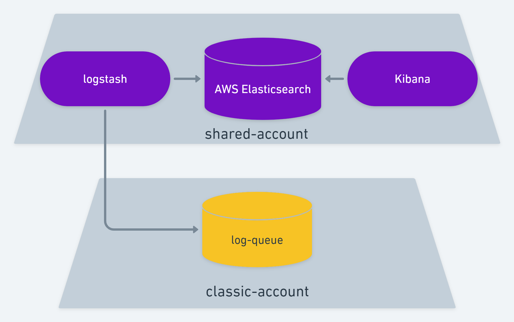
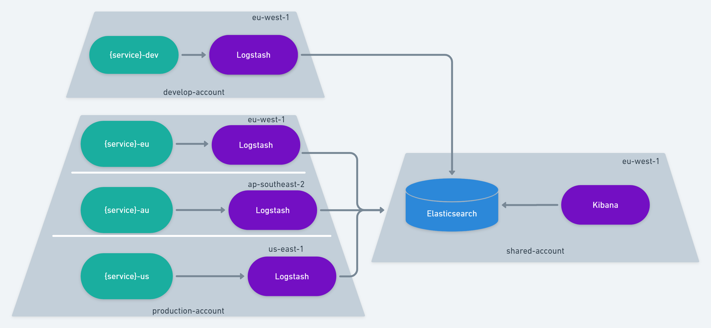
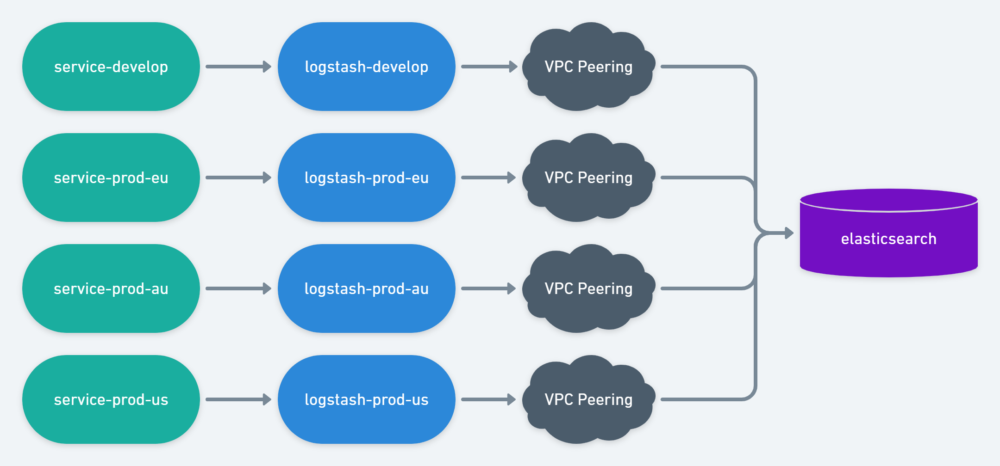
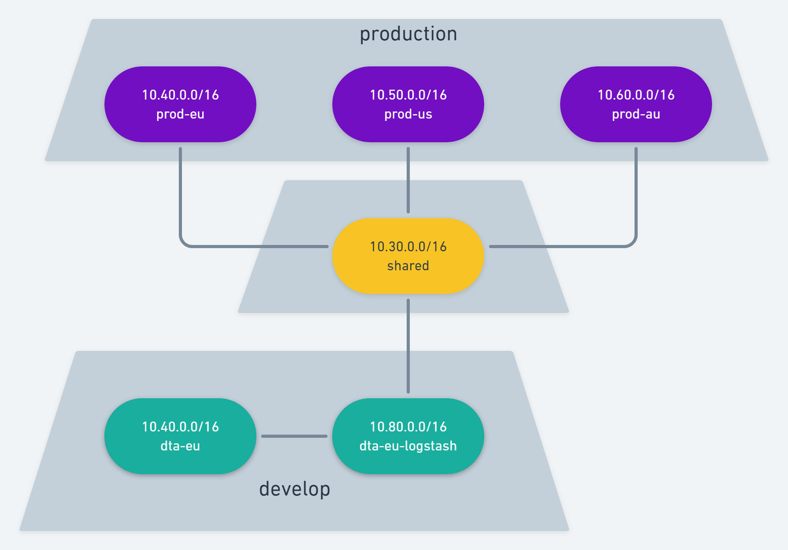

#### Introduction

About 5 years ago there was several places to check for 
information while debugging issues. Some errors would
trigger email to be sent to a specific email inbox while
others would be routed to a more generic inbox. We also
had EC2 instances with access logs / error logs from Apache,
some services would get data into AWS CloudWatch or Slack.
Lastly, we also had some usage of AWS Elastichsearch. Mainly
from the Python team which composes a smaller surface of the
company and managed to get better logs faster than the rest
of the organization. But even then, there was only 1 way
to get data into Elasticsearch: via an SQS Queue.

You see, we have one of those so-called AWS Classic Account
which existed before VPC was ever a thing. And in that account
we have 1 SQS Queue which is worked by a Logstash container
on a newer and limited account that only holds some generic
(not-relevant) things and AWS Elasticsearch.



Over the course of 4 years we tried to move as much as we could
to this exact same setup. Pretty much replace code that was
writing an email or a log file with code that would write
an SQS message so that data would show up on Kibana.
We got pretty far with this and it started helping immensely
not having to dig through multiple places to dig up what happened
in the lifecycle of issues that we were debugging. In time
we had no more slack messages, emails or log files.
We moved everything to a CI/CD strategy that would deploy containers
on Fargate and write logs to stdout / stderr which would
lead to logs showing up on CloudWatch. For quite some time
we have been going back and forth between only Elaticsearch
and CloudWatch for debugging. Elasticsearch would hold
data that usually meant code execution was intact, but
still data configuration could lead to unexpected behaviors.
CloudWatch is where crashes and fatal errors would live,
along with Apache Error Logs.

About 4 months ago I started on my spare time to work on
the next step to improve even further this setup and this
post will dive into the ins and outs of this journey I took.
I'm pretty happy with the result and even though there are some
improvements to be made, I feel I accomplished something
quite nice.

#### I actually wanted metrics

First off, I didn't start this journey because I wanted to improve
logs. That was just a side effect. I actually wanted to collect
metrics. For the past 2 years I've been working on a brand new
API-based Laravel project where I either complete rewrite / redesign
an existing report or I write a new reporting capability on
top of our existing database. This work requires a lot of advanced
SQL query specially because there's lot of table designs which
cannot be changed without breaking 12 years worth of software.
I've been pretty successful with this project and as of today,
nearly 45% of all our reporting features run on top of this
service. I felt like I wanted to collect some metrics out of it.

- Which are the most used reporting functionalities?
- Which customer uses the most out of our database CPU?
- How long does the average report take per API?
- How long does the average report take per customer?
- Are there any users that has a much higher than normal usage?

To answer these questions, I looked into a lot of options. The first one I got
really close was AWS X-Ray. [I even wrote a dummy AWS X-ray instrumentation
for PHP](https://github.com/cgauge/php-x-ray-instrumentation). X-Ray allows
up to 50 indexable fields on a trace, which we can then use for filtering
or group by aggregates. It's a pretty sweet service that tackles what I wanted
but with an impossible limitation for my use case: only 6 hour window aggregates.
I could not ask X-Ray to sort the most used report API in the last 2 weeks
or group the number of API calls by tenant for the last month. X-Ray is
strongly tied to debugging live systems and not collecting metrics.

I also looked into Sentry. Sentry is a pretty good service with support for all
major programming languages and even frameworks. It has logging capabilities
as well as APM (Application Performance Monitoring). However, they don't have
UDP support like X-Ray does. The context I was working from was that I wanted
to collect metrics from a reporting service. I wanted to spend as little overhead
as possible with collecting these metrics and never fail any report because the
APM service failed. On top of that, I got some resistance from management because
I was gonna introduce yet another log solution into the stack and soon we would
have CloudWatch, Elasticsearch and Sentry to look into. Not to mention that
the APM functionality of Sentry didn't seem to be what I wanted either. I'm not 
really looking into memory, cpu, etc. I'm looking for users, customers, number
of executions and average API duration. In my context, one user belongs to a customer
and each customer has a high range of users.

Lastly I looked into Prometheus. If you heard about Prometheus you know that it
offers an interesting approach where services write logs to a local scope with little
or no overhead at all and a separate service managed by Prometheus is supposed to 
consume that. However, the service reporting service I'm focusing is running on
AWS Lambda with Bref. AWS Lambda is as ephemeral as it gets. Other services
are also running as a container on Fargate. Although they're not so limited as AWS Lambda,
it's still a closed environment which I don't want to be customizing so much to get
metrics and logs.

AWS Lambda metrics are also pretty good, but they don't allow me to slice the data
into users or customers. Services not running on AWS Lambda don't have that dashboard either.

#### Kibana was starring at me the whole time

One day my manager presented some Kibana charts that showed a 
huge drop on execution time from a change made by the Python team.
it was one of those basic charts that comes in the Discovery of Kibana
containing the aggregate number of execution and columns over periods of time.
I remember clear as day how that was exactly what I wanted. Count or Average
some Elasticsearch records over time. All I need to do is learn about ELK.
After watching a few videos on 2x speed on Pluralsight I understood the bare basic:

- Elasticsearch is a database
- Kibana is a web service that acts as the frontend of Elasticsearch
- Logstash is a background worker that prepares data and ingest it into Elasticsearch.

With that in mind, I quickly learned that Logstash had support for TCP and UDP.
That meant I could collect metrics using UDP while write logs using TCP.
Kibana would then allow me to filter on any field, aggregate number of execution
and group by customers or users. Everything I wanted in one place.

#### ELLLLK or EL^4K

If you remember from the introduction, we already have an Elasticsearch cluster on
a shared account, a Logstash container working an SQS queue and Kibana up and running.
But for the purpose of collecting metrics, I didn't want to write an SQS message because
of the HTTP/TCP overhead that it brings. I also didn't want services running in US or Australia
establishing a connection with a compute resource in Europe, be that an SQS Queue or Logstash.
That's when I came up with the idea of running one Logstash per region.




The amazing thing about this setup is that services can be
Fargate containers or Lambda functions and they'll still
talk to the same Logstash container. Their communication
overhead will be "region-local" and the cross-region
communication will be left for Logstash to handle.
That means services already moved on and finished their
execution with as little delay as possible.
Services wishing to write a log message can do so using
a TCP connection with the Logstash container while
services wishing to gather metrics can do so using a UDP
connection. We end up with the capability of collecting
metrics while improving the performance of writing
logs and reducing or erasing the SQS cost of writing logs.

In the end we have 4 Logstash containers running on Fargate
with 1 Elasticsearch cluster and 1 Kibana.

#### The Logstash Configuration

A sample of the logstash configuration can be found here:
https://github.com/cgauge/laravel-logstash-apm/blob/main/docker/amazon.logstash.conf

It looks like this:

```
input {
  tcp {
    port => 9601
    codec => json
  }

  udp {
    port => 9602
    codec => json
  }

  sqs {
    queue => "${LOGSTASH_FALLBACK_QUEUE}"
    id_field => "sqs_id"
    polling_frequency => 20
    region => "${LOGSTASH_FALLBACK_QUEUE_REGION}"
    threads => 1
  }

}

filter {
  mutate {
    remove_field => ["path", "host", "port"]
  }
}

output {
  amazon_es {
    index => "logstash-%{service}-%{+YYYY.MM.dd}"
    hosts => ["${ELASTICSEARCH_HOST}"]
    region => "${ELASTICSEARCH_REGION}"
  }
}
```

This configuration exposes 1 port for a TCP connection
and 1 port for a UDP connection. It sets AWS Elasticsearch
as the destination and it also includes an SQS as a fallback
functionality. The SQS fallback will not be used when collecting
metrics as it's better to lose them instead of causing
execution delays. However, if something goes wrong and we
need logs to be written, then we want to make a best effort
that these logs will be written. In case the Logstash container
is unreachable, we can then write the log into an SQS queue
and let Logstash pick it up. Yes, it's similar to what we
already had, but this is a last resort that 

1) will rarely be used 
2) provides a region-specific queue and 
3) guarantees a best-effort in writing logs.

#### Deploying Logstash

AWS ECS has integration with Route 53 for private DNS.
We can use Service Discovery to attach a DNS onto the private
IP address of the container. This means services can simply
talk to `logstash.internal` and AWS will make sure that
this DNS resolves to the private ip address of the Logstash
container. If more than 1 container is running on ECS,
AWS will offer a simple load balacing capability resolving
one IP at a time.

The CloudFormation template to deploy this Logstash container
can be found here: https://github.com/cgauge/laravel-logstash-apm/blob/main/amazon/logstash/template.yaml

#### VPC Peering

If things can go wrong, they will go wrong. For this project,
VPC Peering was the cherry on the cake that almost blew up
the entire project. AWS Elasticsearch is running behind
a VPC on our "shared account" and is unreachable from the
internet. This means that we need VPC peering to establish
connection between all 3 production VPC and the develop VPC
with the Elasticsearch VPC.



However, AWS VPC does not let we peer 2 VPCs with the same CIDR.
That would make it impossible for them to route traffic
from point A to point B reliably because they would not be able
to tell if e.g. 10.0.15.31 belongs to VPC A or VPC B.

Fortunately the people that had setup our VPC thought about
potential peering and had each region using a different CIDR.
The "shared-account" with Elastisearch also had one separate
CIDR. However, the develop account runs only on Europe
and it clashes with our production account Europe. In other
words, it's impossible to have our develop account and our
production account peering with our shared account at the
same time.

The good thing about ELK is that it's a 3 node communication:

- Service communicates with Logstash.
- Logstash communicates with Elasticsearch.

That means for our develop account only we can setup an extra
VPC only for Logstash.



This means that develop will have 2 VPCs and will peer
the services VPC with the Logstash VPC. We will never be able
to pull data from Elasticsearch this way, but since it's
only meant for Logs and Metrics, that's an acceptable limitation.
Services will talk to Logstash via a VPC peering which will then
talk to Elasticsearch via another VPC peering. The production
account will not have any of this mess.

Maybe one day we'll recreate the entire develop account
and get rid of this quirk, but right now we think that
it's not worth the weeks worth of effort to delete everything
so that we can delete and recreate the VPC and then recreate
over 30 fargate containers and 50 lambda functions that
make up our AWS account.

#### Conclusion

After extensive research on multiple approaches, some fast 
failures and lots of studying, I got Logstash up and running
on all our production regions and started collecting metrics
via UDP. It already helped us diagnose some internal DoS
issues as well as some Aurora / Elasticache DNS issues.
We're able to make better decisions driven by customer usage.
Data never leaves AWS infrastructure for compliance. 
No personal identifiable information is stored on
Elasticsearch. Data gets automatically cleaned up after 30 days.
AWS manages the Elasticsearch Cluster. Kibana provides great
visualization for the metrics collected. Fargate and Lambda
services are able to write logs in a single, reliable channel
 / format. PHP, Python and NodeJS are able to talk to Logstash
if those teams decide to make use of this solution.
The VPC 'quirk' on the develop account isn't really relevant
for developers. The whole infrastructure works wonderfully.

Hope you enjoyed the reading as much as I enjoyed building
this. Talk with me on [Twitter](https://twitter.com/deleugyn).

Cheers.