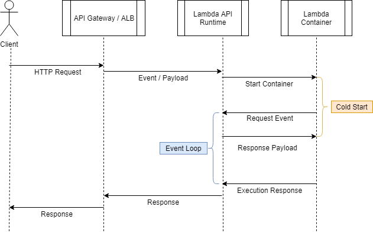

While reading through [Bref](https://bref.sh)'s source code and working with
AWS Lambda, I found it to be important for me to get as much understanding
of the process as I could. That usually helps me understand why an issue
happens the way it does. For instance, deploying a php cli function
that never calls Bref's `lambda()` helper leads to a never-ending
execution. My understanding of the Lambda Function model explains why that
happens. **Here goes a lot of assumptions.**

#### Timeline

 
If we consider an API Lambda Function, it's usually executed by Api Gateway (APIGW)
or Application Load Balancer. Regardless of which, the user will send a
request using a service DNS so that the receiving end (APIGW or ALB) can then
communicate with the Lambda Runtime API (an internal AWS service). **I assume**
the Runtime service stores the payload of the request somewhere internally
(DynamoDB?) and initiates the process to start a container. As soon as the
container is up and running, it will have a chance to run any bootstrapping
process and will end up entering a `while(true)` (Event Loop). Here, the code 
will make an HTTP call to the Lambda Runtime API asking if there's any work
to be done. The answer seems obvious: of course there is work to be done,
otherwise the container would not have started. This is where the actual 
Lambda Function starts it's execution and our code gets a chance to run.
This also represents the end of the ~~in~~famous Cold Start.

The Lambda code will finish it's execution and return a response. This
response is sent back to the Lambda Runtime API via an HTTP Request
that contains a unique identifier; this is how the Runtime knows to which
request this response belongs to. In possession of a response, AWS's internal
service now have the content that APIGW or ALB requested and can promptly
reply to that, leading to the end of the Request / Response lifecycle.

#### Err... and the container?

Remember I said the container starts, bootstraps and enter an event loop?
This means that the container sent a response back and started all over again.
In the 2nd execution, the container makes another call to the Lambda Runtime
to get some other work to do. If there's nothing more to do, the request
will stay alive in a long-polling process waiting until there's an answer.
**I think** two outcomes are possible: a new request comes in and the 
request finally gets a response so that it can start working on the next
request or a new request never comes in. For the 1st option, it seems
simple to imagine that the code will be executed again, send the response
and start the loop all over. As soon as the container calls the Lambda Runtime
to get a new payload, the billing time ends and the request stays locked
in a long-polling. If it stays locked there for too long, AWS uses an
external process to send a shutdown signal to the container, which
means our code never gets executed again and the container is terminated.

Next time there's work to be done, a new container will have to face the
bootstrapping process before it can work the payload.

#### What about non-api executions?

As I've said [on another post](https://blog.deleu.dev/running-lambda-behind-application-load-balancer/),
Lambda is extremely decoupled from it's executioner. If a Lambda function
gets executed by API GW, ALB, SQS, SNS, S3, Aurora or direct invocation, it's all
the Lambda Runtime's job to store the payload and start a container that
will come back to the Runtime and ask for work to do. It's also the Lambda
Runtime's job to know the context which a Lambda got executed. If an invocation
comes from API GW or ALB, it should take the response and send it back as
an HTTP Response. If it's source is SQS, it should delete the SQS Message.
If it's SNS, I imagine there's nothing else to be done. If it's a direct
invocation, it sends the response back to the client that invoked it.

#### Where does VPC cold start fits into this?

I'm not a network expert, but I can imagine the troublesome process of provisioning
a secure channel between the Lambda container and a specific VPC on a specific
account. This is never a generic network interface as each VPC is unique. Putting
Lambda inside the VPC incur in the overhead of forcing AWS to provision such
infrastructure. As announced on the last re:Invent 2018, the Lambda team is
working on (as far as I understood) provisioning the network at Lambda creation
time so that the network is always available and replacing this huge overhead
of the cold start with a local NAT with a secure channel to the ENI provisioned
on creation time, reducing the cost of starting a VPC-based Lambda.

#### Conclusion

This post contains a lot of assumptions. Some things make sense
when you see how a `provided` runtime is programmed (such as [Bref](https://bref.sh)),
but there are wild assumptions nonetheless. Even if they're wrong, they were
still pretty useful insights for me to understand how my lambda can enter
an endless execution if my code never makes the Lambda Runtime API call
to get the reason why the container was started.

I also found it to be a bit weird that a service A (Lambda Runtime) would
invoke a service B (start a container) and give it no context at all
about it's purpose in life. But once we look underneath to see the reasoning
for that, it makes it so beautiful. By letting the container come back to
ask for something to do (breaking the Tell, Dont Ask pattern), AWS can leverage
long-polling and an infinite while-loop to get the container to always come
back to get more work to do from the Runtime.

I hope there are useful bits of information for anyone out there going
through the challenges of learning Lambda Function, specially in the PHP
context. If you have any feedback, find me on [Twitter](https://twitter.com/deleugyn)!

Cheers.