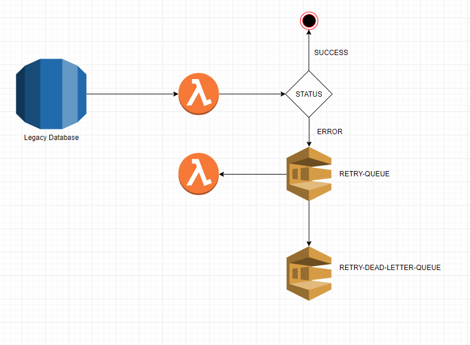

For the past month I've been working on a project that will help replace
some of the legacy codebase. The goal is to use Aurora MySQL triggers to 
invoke a Lambda function whenever there's any data change in a table.
Aurora invokes Lambda asynchronously, which means the [Lambda will automatically
retry twice if the execution fails](https://docs.aws.amazon.com/lambda/latest/dg/retries-on-errors.html).
Sometimes only two retries are not enough and losing the event is definitely
not an option.

The first thing that comes to mind when trying to avoid losing events is to 
configure a Dead Letter Queue (DQL) on the Lambda function. AWS allows an SQS 
Queue to act as a DLQ. If you're familiar with AWS SAM, the configuration looks
like this:

```yaml
  DeleteListener:
    Type: AWS::Serverless::Function
    Properties:
      Role: !GetAtt LambdaExecutionRole.Arn
      CodeUri: .
      Handler: artisan
      Timeout: 60
      MemorySize: 1024
      Environment:
        Variables:
          ARTISAN_COMMAND: 'entity:deleted'
      Layers:
        - !Sub "arn:aws:lambda:${AWS::Region}:209497400698:layer:php-73:6"
      Runtime: provided
      VpcConfig:
        SecurityGroupIds: [!ImportValue AllowAllAddressesContainerSecurityGroup]
        SubnetIds: !Split [',', !ImportValue PrivateSubnets]
      DeadLetterQueue:
        Type: SQS
        TargetArn: !GetAtt [RetryDeleteQueue, Arn]
```

For my use case, the next step of the idea naturally came to mind immediately
after. The concept goes like this: Aurora triggers my lambda, which fails to
execute because of the order of events. If the event is stored in a DLQ, I can
have another lambda use that DLQ as the source of Events.

```yaml
  RetryDeleteListener:
    Type: AWS::Serverless::Function
    Properties:
      Role: !GetAtt LambdaExecutionRole.Arn
      CodeUri: .
      Handler: artisan
      Timeout: 60
      MemorySize: 1024
      Environment:
        Variables:
          ARTISAN_COMMAND: 'retry:entity:deleted'
      Layers:
        - !Sub "arn:aws:lambda:${AWS::Region}:209497400698:layer:php-73:6"
      Runtime: provided
      VpcConfig:
        SecurityGroupIds: [!ImportValue AllowAllAddressesContainerSecurityGroup]
        SubnetIds: !Split [',', !ImportValue PrivateSubnets]
      Events:
        Retries:
          Type: SQS
          Properties:
            Queue: !GetAtt [RetryDeleteQueue, Arn]
            BatchSize: 1
```

To recap: Aurora Triggers DeleteListener Lambda. If it fails, the payload is 
preserved on a DLQ called RetryDeleteQueue. RetryDeleteListener Lambda will
use the RetryDeleteQueue as an Event Source, which allows for more retries.
Finally, to avoid poison-pill messages, we configure a DLQ on the DLQ so that
after X amount of attempts, we can finally give up, but still store the 
message for further investigation. The DLQ configuration looks like this:

```yaml
  RetryDeleteQueue:
    Type: AWS::SQS::Queue
    Properties:
      VisibilityTimeout: 90
      MessageRetentionPeriod: 604800
      ReceiveMessageWaitTimeSeconds: 20
      RedrivePolicy:
        deadLetterTargetArn: !GetAtt [RetryDeleteDeadLetterQueue, Arn]
        maxReceiveCount: 3

  RetryDeleteDeadLetterQueue:
    Type: AWS::SQS::Queue
    Properties:
      MessageRetentionPeriod: 1209600
```

The complete process is described in the image below:



#### Conclusion

This kind of setup is relevant when your primary event source cannot push
a message to SQS, which is the case for AWS Aurora. Aurora can only execute
a Lambda function, which may or may not fail to accomplish it's goal on
the first attempt. Using a DLQ allows us to prevent the loss of the payload.
Since the Payload is now on an AWS Queue, we can leverage Lambda Event Sourcing
to retry these messages a few more times while still leveraging another
Queue as the give-up moment. If a message lands on the RetryDeleteDeadLetterQueue
we should investigate why the code is failing to accomplish it's goal.

While working on this solution, two things were important to note:

- The Queue Visibility Timeout cannot be smaller than the Lambda timeout.
- The Aurora event payload is different than the SQS payload.

The first item seems pretty obvious once you realize what it means, but
I had to get an error from Amazon before realizing it. If the message
comes back to the Queue in 2 seconds, but the Lambda reserves the right
to take 30 seconds to execute it's job, we could end up processing the
same message multiple times because it could always become visible again.
The Queue visibility timeout has to take into account that the Lambda might
take the full time to execute the message.

The second one is less obvious, but just a detail. The Aurora payload is
the exact JSON that the trigger passes to the Lambda. The SQS, on the other
hand, will be available at `$event['Records'][0]['body']` and will require
you to `json_decode()` it as it will be a plain string.

Reach out to me on [Twitter](https://twitter.com/deleugyn) if this helped you.

Cheers. 