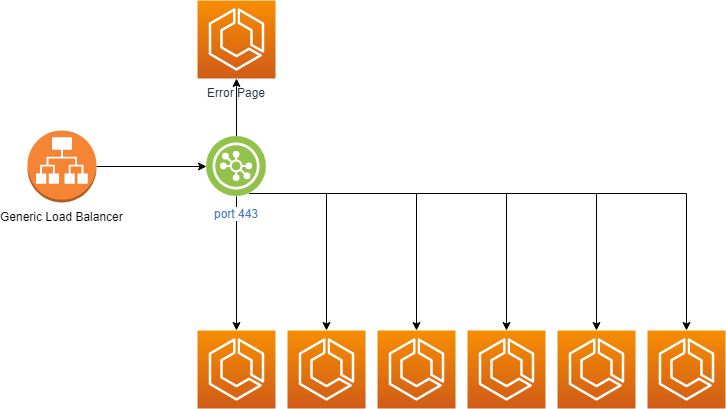

If you read my [introduction](https://blog.deleu.dev/introduction), you know
I'm a cheap person. A few months ago I worked on a project that had about 10
microservices. The company had a QA account and a production account. Each
microservice had their own Application Load Balancer (ALB). The result was 
20 ALB running 24/7. One ALB incur a minimum cost of approximately $190 yearly.
Math time.

```
$190/year * (10 QA ALB + 10 PROD ALB) = $3800/year
```

Furthermore, the company had plans to release 10 more microservices in the 
coming year. It didn't take much to see this model wouldn't financially 
scale.

The first thing I noticed when looking on an optimization strategy was the
fact that all load balancers had their usage below 5 to 10 percent.
This meant that worst-case scenario, a single load balancer was able to
support all microservices. The second (and most important) thing I learned
about AWS ALB is that they're highly scalable. If your usage goes above
100% of your available LCU, Amazon simply scale your load balancer for you
and charge you by the hour. This meant that we could easily replace all
ALBs with a single one and still be confident that the services would be
available. The company would pay only $190/year plus any extra cost to cover
high demand hours. Off to implementation I went.

Caveat #1: An Application Load Balancer only allows 1 listener per port.
If you have 10 Web Server microservices, it's only natural that all of
them need to use port 80 or 443. Bottom line is we cannot establish one
Listener per project on a single ALB.  The conclusion is that we would
have a single Listener for all HTTPS (443) and a single listener for all
HTTP (80), which leads to Caveat #2.

Caveat #2: Every Listener MUST have a default action (Target Group). This
is a tricky thing for a few reasons. The creation of the Listener becomes
coupled with the creation of the default microservice. If there's ever a 
need to deprecate, retire, remove or replace the *default* microservice,
it could mean an organization-wide downtime to replace the Listener.
Besides that, if someone reaches out to [specific-microservice.yourdomain.com](specific-microservice.yourdomain.com)
and for some reason your rule is missing from the Load Balancer, they would
land on the *default* microservice, which could be extremely confusing to
an end-user. The solution I took at the time was to come up with an 11th
microserivce with the purpose of being the *default* ALB action and providing
an error page. If someone landed on that microservice, it's due to a misconfiguration.
Besides, there would never be a reason to deprecate or remove that service
as it's purpose in life is to just be the *proxy owner* of the Load Balancer
resources.



Caveat #3: The timeout is part of the Load Balancer settings. In other words,
every microservice will have to share the same timeout. Most of the time
this isn't a problem, but I decided to list it anyway as it's something
you should watch out.

Caveat #4: A Load Balancer is either **internal** or **internet-facing**. If
you have internal-only services, you'll have to pay for at least two ALBs:
an internal one and an internet-facing one.

### The implementation

As mentioned, to save costs on all 10 ALB, first we need 1 more ALB to rule
them all. Here's how we set it up:

```yaml
  LoadBalancer:
    Type: AWS::ElasticLoadBalancingV2::LoadBalancer
    Properties:
      Scheme: internet-facing
      LoadBalancerAttributes:
        - Key: idle_timeout.timeout_seconds
          Value: 60
      SecurityGroups:
        - !Ref LoadBalancerSecurityGroup
      Subnets: !Split [',', !ImportValue PublicSubnets]
      
  LoadBalancerSecurityGroup:
    Type: AWS::EC2::SecurityGroup
    Properties:
      GroupDescription: Allow HTTP/HTTPS from anywhere
      VpcId: !ImportValue Vpc
      SecurityGroupIngress:
        - IpProtocol: tcp
          FromPort: '80'
          ToPort: '80'
          CidrIp: 0.0.0.0/0
        - IpProtocol: tcp
          FromPort: '443'
          ToPort: '443'
          CidrIp: 0.0.0.0/0
      SecurityGroupEgress:
        - IpProtocol: '-1'
          FromPort: '-1'
          ToPort: '-1'
          CidrIp: 0.0.0.0/0
          
  LoadBalancerDns:
    Type: AWS::Route53::RecordSet
    DependsOn:
      - LoadBalancer
    Properties:
      HostedZoneId: !ImportValue HostedZone
      Name: !Join ['', [alb., !ImportValue Zone]]
      Type: A
      AliasTarget:
        DNSName: !GetAtt [LoadBalancer, DNSName]
        HostedZoneId: !GetAtt [LoadBalancer, CanonicalHostedZoneID]
        
  # If you need HTTP Requests on port 80
  HttpListener:
    Type: AWS::ElasticLoadBalancingV2::Listener
    Properties:
      DefaultActions:
        - Type: forward
          TargetGroupArn: !Ref ErrorPageTargetGroup
      LoadBalancerArn: !Ref LoadBalancer
      Port: '80'
      Protocol: HTTP

  # HTTPS Requests on port 443
  HttpsListener:
    Type: AWS::ElasticLoadBalancingV2::Listener
    Properties:
      DefaultActions:
        - Type: forward
          TargetGroupArn: !Ref ErrorPageTargetGroup
      Certificates:
        - CertificateArn: !ImportValue WildcardCertificate
      LoadBalancerArn: !Ref LoadBalancer
      Port: '443'
      Protocol: HTTPS
      SslPolicy: ELBSecurityPolicy-TLS-1-1-2017-01
  
  ErrorPageTargetGroup:
    Type: AWS::ElasticLoadBalancingV2::TargetGroup
    Properties:
      TargetType: lambda
      Targets:
        - Id: !GetAtt [ErrorLambda, Arn]
```

Now that we have the load balancer up and running, we can start to setup
all microservices to use it. That would look something like this:

```yaml
  Certificate:
    Type: AWS::CertificateManager::Certificate
    Properties:
      DomainName: my-microservice.mydomain.com
      DomainValidationOptions:
        - DomainName: my-microservice.mydomain.com
          ValidationDomain: mydomain.com
      ValidationMethod: DNS
      
  Dns:
    Type: AWS::Route53::RecordSet
    Properties:
      HostedZoneId: !ImportValue HostedZone
      Name: my-microservice.mydomain.com
      Type: CNAME
      ResourceRecords:
        - !ImportValue LoadBalancerDns
      TTL: 3600
      
  HttpsListenerRule:
    Type: AWS::ElasticLoadBalancingV2::ListenerRule
    Properties:
      Actions:
      - Type: forward
        TargetGroupArn:
          Ref: TargetGroup
      Conditions:
      - Field: host-header
        Values:
        - my-microservice.mydomain.com
      ListenerArn: !ImportValue HttpsListener
      Priority: 1
      
  AttachCertificateToListener:
    Type: AWS::ElasticLoadBalancingV2::ListenerCertificate
    Properties:
      Certificates:
        - CertificateArn: !Ref Certificate
      ListenerArn: !ImportValue HttpsListener
      
  TargetGroup:
    Type: AWS::ElasticLoadBalancingV2::TargetGroup
    Properties:
      HealthCheckIntervalSeconds: 120
      HealthCheckProtocol: HTTP
      HealthCheckTimeoutSeconds: 30
      HealthyThresholdCount: 2
      HealthCheckPath: /healthy
      Matcher:
        HttpCode: '200'
      Port: 80
      Protocol: HTTP
      TargetGroupAttributes:
        - Key: deregistration_delay.timeout_seconds
          Value: '30'
      UnhealthyThresholdCount: 3
      TargetType: ip
      VpcId: !ImportValue Vpc
      
  #### The Service and Task Definition are out of the scope of this post.
```

If we configure the microservice DNS to point to the Load Balancer DNS,
we can setup the Listener Rule to use the Request Header to use the
microservice's target group. This file also shows how to attach the 
Microservice's Certificate to the Listener for HTTPS Listeners.

Bonus Caveat: Notice that to create the Listener Rule, we must specify a
priority. This number cannot be reused when attaching more Rules to the
same Listener. For the use-case I was working, the priority order did not
matter at all as each microservice had their own domain and wouldn't compete
with other microservices requests. But it is a bit of an annoyance that
if you deploy a new microservice with the same priority, you get an error.
I ended up preparing a table of microservices and their priority rules
to serve as a dictionary when launching a brand new microservice. That way,
developers would consult the table, choose the next priority that would be
used and update the table. The table looks something like this:


| Microservice | Priority |
|--------------|----------|
| Authentication|   1     |
| Legacy A (HTTP)|  2     |
| Legacy A (HTTPS)| 3     |
| Reporting    |    4 & 5 |
| Service X    |    6 & 7 |
| Service P    |    8     |

### Conclusion

I really enjoyed working on this project. It brought down the operational
costs by a substantial amount, which on it's own is a successful optimization,
but it also helped the team sell the idea that we can release more and more
microservices without increasing the AWS bill exponentially.

As always, hit me up on [Twitter](https://twitter.com/deleugyn) with any
questions. 

Cheers.