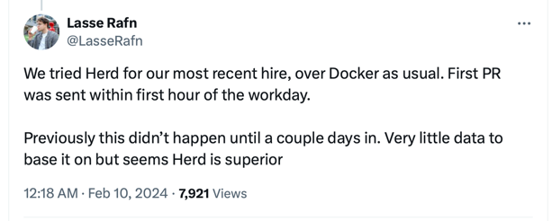

The amount of little things that Laravel provides is astonishing, but
it's very easy for developers to take simplicity for granted because
of their high capacity to handle complex tasks. While I'm eagerly
waiting for the release of Laravel Reverb, I want to talk about
some of the changes I've recently made at my workplace and some of
their outcome.

### Laravel Herd

[Laravel Herd](https://herd.laravel.com) has been one of the biggest quality of life improvements
Laravel has brought to the PHP ecosystem recently. It's easy to 
install, configure and use. I have two non-technical people on my team
that are responsible for Product Management, Release Management, UI/UX
and everything that entails and they have been able to run the project
on their local machine within 1 hour. Herd has taken the burden of
helping folks that have never interacted with PHP in their lives to
have PHP, Composer, Nginx, custom local DNS and TLS up and running
within a couple of minutes without having to understand all the hustle
of PHP extensions, `/etc/hosts`, OpenSSL, `php.ini`, `nginx.conf`,
Docker or any other complexity that accompanies Software Development.

Some folks might say that tools like Herd makes developers less
aware of the underlying infrastructure required to work with a PHP
project, but that mindset misses the point that for folks like
Designers or Product Managers, learning PHP is not their goal. New hires
and Jr. Developers also benefit by being able to add value to their
workplace while still buying time to dive into the complexity of
understanding the PHP ecosystem.

### Inertia

Inertia has been another game changer for us. For years I worked
with an architecture where I'd develop backend APIs using Laravel
and the frontend runs as a SPA using React. I spent years advancing
my skills with Laravel and building a powerful backend with
automation tests, purpose-built APIs and a smooth architecture
for developers to jump in. Meanwhile the frontend didn't have the
same experience. I tried doing automation tests on frontend a few times
and I also tried to figure out a good strategy for building React
components, but I was never satisifed with it.

The big "click" for me was when I realized that this frontend/backend
architecture was intrinsically harder on frontend development because
it "forces" every React component to have a lifecycle of:

- The component starts with an empty state
- The component makes an API call to the backend
- The data arrives asynchronously and is stored on local state
- The state change re-renders the component

When I think about a PHP class vs a React Component in this architecture,
it's easy for me to realize that in the backend I'm pretty much never
making changes to the data that is injected into a PHP class, meaning
we strive for immutability whenever we can. Meanwhile the React Component
starts off from a place of:

- Everything is nullable / undefined (API call hasn't happened)
- Everything is mutable (when data arrives it needs to be locally stored)
- Components are bound to am API Service Locator

This not only makes the type definition harder to reason about,
but also testing it will always require to fiddle around with
mocking Axios calls or hoisted ES Modules mocks.

Inertia shifts this out to a more traditional mindset. With Inertia,
we quickly noticed that there is one very special type of frontend
components: a Page component. This special component can be thought
of as a more traditional "immutable", dependency-injected, no service
locator PHP class. When writing a Jest test for an Inertia Page
Component, we are able to inject all the page data in its constructor.
The component doesn't have the notion of a lifecycle starting without
data and making an API call to gather its data. Instead, we are given
the backend data right into the component initialization, making
testing it a lot more smooth. The type system and the reactivity are
also improved because we don't have to make everything optional
and we're also not forced to always re-render a component at least
twice (once without data and once with data).

Paired with Laravel Herd for an easy development environment, Inertia
takes away a huge complex layer of stitching together frontend
and backend.

### Vue

I wrote a more extensive post about my experience with Vue (and frontend
development) [here](https://blog.deleu.dev/first-reactions-to-fullstack-development-in-2023/).
For the purpose of this post, it's suffice to say that Vue brings
a bit of similarity with Laravel which I attribute to the fact that
there is one person building up the project's vision. We can see
how Taylor has built the Laravel ecosystem to work perfectly with
everything-Laravel. I feel like Vue got this one right as well by
having a single vision powering Vue, Vite, Vitest, Vue-Test-utils.
Like Laravel, Vue seems to want to provide a smooth and easy experience
for developing the 90% of the use cases. It pairs really well with
Tailwind and it has a great separation of concerns between HTML
(the DOM) and Javascript (the reactivity). The fact that React
allows for chaining components inside components with a simple 
`{someOtherJsFunctionThatReturnsMoreDOM()}` makes reasoning about
the final template extremely hard.

Designers and Product Managers can jump in and make changes to
Vue templates with so much ease that sometimes it's easier to
mockup the next product development straight into Vue than doing it
on Figma.

### GitHub Desktop

This one isn't brought by the Laravel ecosystem, but it's quite a 
great tool to get someone like a Product Manager with no 
Terminal / CLI knowledge to be able to make changes to
the project (mockups, UI, etc), commit and push to GitHub, so
I thought it was worth a quick mention.

### Conclusion

Software Development is a complex cognitive process by design. As such
I think we grow our tolerance for it with ease and get used to it
and brush it off as part of business. One of the most important
skill I've been learning is to evaluate whether something is
easy or complex not by the ability of a high skilled developer
to read, understand, use and modify it, but rather by the ability
of a smart but completely inexperienced person to go into the
field of software development with very little guidance and still
manage to figure things out and make sense of the industry that
is the internet software.

Follow me on

- https://twitter.com/deleugyn
- https://fosstodon.org/@deleugpn
- https://threads.net/@marcodeleu

Cheers.